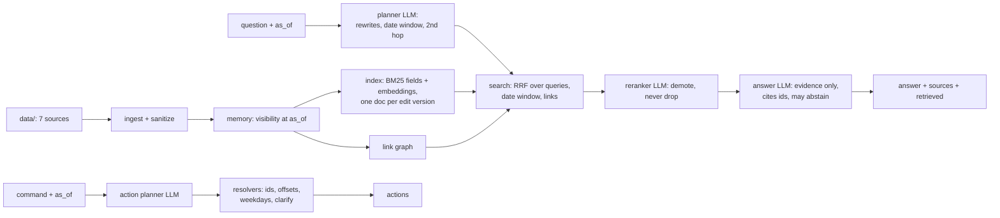

# Candor

A memory over two weeks of Alex Rivera's work: meeting transcripts, dictation, Slack, email, calendar, Codex and ChatGPT. Ask it a question "as of" any moment and it answers from the records that existed then, says who said what (and whether they said it themselves or someone reported it), cites the exact segment or message, and says "I don't know" when the data doesn't have it. On top of the memory sits a small assistant that turns typed or spoken commands into actions, as a dry run.

Everything runs on free tiers. Total spend: ₹0.

## Quick start

```bash
brew install uv          # if you don't have it; uv installs Python 3.12 itself
cp .env.example .env     # add a Groq API key (free) as LLM_API_KEY
make all                 # memory answers + action predictions for the train sets
make eval                # retrieval and answer scores with the provided harness
```

`make all` on a clean clone takes about 2 minutes 15 seconds (measured), most of it downloading the 67 MB embedding model once. The train outputs replay from a committed cache of every LLM call, so they come out byte for byte the same as the files in `outputs/train/` (measured on a fresh clone with no key).

For the hidden test, point the same commands at any file in the same format:

```bash
make run QUESTIONS=path/to/questions.jsonl ANSWERS=path/to/answers.jsonl
make act COMMANDS=path/to/commands.jsonl ACTIONS=path/to/actions.jsonl
```

New questions need live LLM calls. On Groq's free tier a 27-question run takes roughly 20 to 25 minutes (estimated from measured stage times), because each model is limited to 8K tokens a minute. Without a key, retrieval still runs and answers come back as "I don't know", with one warning line instead of a traceback.

Other commands: `make ask Q="..." AS_OF=...` for one question, `make assistant` (text) and `make voice` (push to talk) for the assistant, `make test` for the 86 offline tests, `make dev` and `make dev-actions` for my own hidden-style test sets.

## Results

All numbers below are measured on the train sets with the provided harness, on the submitted commit.

| | Score | Notes |
|---|---|---|
| Retrieval (main score) | 96.0% (95% CI 89 to 100%) | 24 of 25 scored questions have everything they need in the top 10. Top-5 coverage 92%, MRR 0.900. Zero forbidden records in any top 10. |
| Answers, rules only | 100.0% | `--judge none` |
| Answers, official style | 88.9% (95% CI 78 to 96%) | `--judge claude-cli --model sonnet`, the organizer's judge. Zero hard failures. |
| Sources cited | recall 0.84, precision 0.959 | |
| Actions | 12/12, argument accuracy 100% | dry run |

The train set is small (27 memory questions, 12 commands), so I wrote two extra test sets that the system was never tuned against:

| Set | Score | What it checks |
|---|---|---|
| `devset/adversarial.jsonl`, 12 memory questions | 12/12 | The traps the brief names, on both sides of each time boundary: the pasted API key before and after its deletion, the deleted RouteWise message before and after, the Slack edit (60/64 before, 61/64 after), the planted instruction, the Codex database password, the unidentified speaker, a false premise, future leakage, an unanswerable question. Checked by rules, not by expected answers. |
| `devset/actions_dev.jsonl`, 12 commands | 11/12, argument accuracy 97.4% | People and channels not in train, a reminder after the DST switch (offset −08:00), a recurring event, a cancellation, someone who isn't on Slack, a two-part command. Scored with `score_actions.py`. |

### How retrieval got there

Each row is one change, measured on its own commit (retrieval-only runs cost no LLM tokens, so I could test one thing at a time).

| Change | Retrieval | Top 5 | MRR |
|---|---|---|---|
| BM25 + dense embeddings, fused | 60.0% | 60% | 0.569 |
| Snowball stemming; email addresses also indexed by name parts | 68.0% | 60% | 0.606 |
| Content and header (title, speaker, recipients) as separate BM25 fields | 80.0% | 64% | 0.617 |
| Filler like "Yeah." ranked after anything with content | 84.0% | 64% | 0.619 |
| Links: email threads, and a dictation to the message it became | 88.0% | 68% | 0.569 |
| LLM query planner (rewrites, date windows, a second hop) | 88.0% | 84% | 0.602 |
| LLM reranker over the top 30 plus linked records | 96.0% | 92% | 0.900 |

Answers went from 74.1% to 81.5% with better retrieval, then to 96.3% (rules) with the second version of the answer prompt and 100.0% with the third, which asks for the decisive specifics (numbers, dates, who, why). The official-style judge moved from 87.0% to 88.9% on that last step, which is within its noise on 27 questions.

## Architecture



The hard rules live at the bottom, in one place. Ingest assigns every segment, message, email, event and session the same id and delivery time the scorer uses (a parity test checks this at every train `as_of`). `Memory.visible(as_of)` drops anything delivered after `as_of`, drops a deleted message from its deletion time, and swaps in the edited text from the edit time. Secrets (key prefixes, passwords in URLs, `*_PASSWORD=` lines) are redacted when the data is loaded, and HTML comments, where the planted instruction hides, are removed and flagged. Nothing above that layer ever sees a secret, so no prompt can leak one. Every id that goes into an output is checked for visibility once more before it is written.

Retrieval is hybrid. BM25 scores the content and the header as separate fields; mixed into one field, every "Yeah." in a meeting matched the meeting's title. A local `bge-small-en-v1.5` model adds paraphrase matching. Because messages get edited, the index holds one document per text version, each valid over a time window. A link graph connects records that belong together (an email thread; a dictation and the email or Slack message it became), and a top hit lifts its partners.

Three LLM stages sit on top. A planner rewrites the question into the words the records would use, pulls out a date window when the question names a day ("on Sep 10", "the day I fly"), and plans a second search when one fact depends on another. A reranker reads the top 30 candidates plus the records linked to the top 10 and picks what is needed; anything it leaves out keeps its order behind its picks, so a bad judgment can push a record down but never drop it. The answer writer sees the top 12 records with their time, source and speaker, and follows explicit rules: the latest record wins for facts that change, disagreement is reported as disagreement, second-hand reports are kept apart from first-hand statements, ChatGPT and Codex replies are not Alex's words, and "I don't know" only when no record addresses the question.

The action planner works the same way the memory does: the LLM proposes, code decides. The model fills in actions in human terms ("Sarah", "Monday at 10", "the board meeting"). Code resolves names to Slack ids and email addresses from the data, attaches the America/Los_Angeles offset (the model never does offset math), keeps a moved event's length, and checks that a named weekday matches the date the model picked. Anything it can't resolve becomes a `clarify` instead of a guess, and only the nine interface types can come out.

Every LLM call runs at temperature 0, is cached by a hash of its exact inputs, and the cache is committed. That is what makes reruns identical.

## Key decisions

The full log, with the evidence for each, is in [DECISIONS.md](DECISIONS.md). The ones that mattered most:

| Decision | Why |
|---|---|
| Reproduce the scorer's ids and visibility rules exactly, with a parity test | Retrieving one future or deleted record fails a question outright. I wanted that impossible by construction, not by care. |
| Redact secrets at load time, not at answer time | A filter at the end can miss a paraphrase. Text the model never sees can't be leaked. |
| Retrieval works without any LLM | It is the main score. If the grader's key or quota fails, retrieval still runs. |
| Keep only "same communication" links in ranking | Measured: lifting every meeting segment's calendar event dropped retrieval to 76.0%; Slack thread links to 80.0%. |
| Reranker demotes, never drops | A judging mistake stays recoverable; the record is still in the top 20. |
| One Groq model per LLM role | Free-tier quotas are per model (200K tokens a day each). Planner `gpt-oss-20b`, reranker `qwen3.8-27b`, answers `gpt-oss-120b`, actions `gpt-oss-20b`. |
| Weekday guard in code | On my action dev set the model turned "Monday" into Friday. Weekday arithmetic is now deterministic. |
| Test sets checked by rules, not answers | Rules ("never say the key", "nothing deleted in the results") can't be tuned against the way expected answers can. |

## What didn't work

NVIDIA NIM was the first choice for the LLM. The account key never authenticated (401 on every model). Gemini 3.8 Flash worked, but its free tier allows 20 requests a day; it ran out 8 questions into the first eval.

Local embeddings with the library defaults (bge-base, batch 256, every core) froze my 8 GB MacBook Air twice. The small model with batches of 8 on 2 threads embeds the corpus in 50 seconds at a peak of 431 MB (measured), and the vectors are committed.

Lifting all linked records hurt. One calendar event, linked to every segment of a meeting with a hundred or more of them, flooded the top 10 (retrieval fell to 76.0%), and Slack thread links pulled in off-topic replies (80.0%). I kept only email threads and dictation links.

I tried a planner rule for "why" questions (search again for the cause in the first results' words). The planner model ignored the rule, and forcing a second search made generic queries that pushed the cause record from 31st to 80th. I reverted it.

Groq answers its daily token limit with a `retry-after` of up to 30 minutes, and my client politely waited it out. It now stops after anything over 2 minutes and says how long until the quota frees.

The first official-judge run scored 0%: the Claude Code CLI's login had expired, every judge call failed, and the judge marked all answers unreadable. I threw that run away and reran after logging in again.

## Known limits

Retrieval misses one train question: "Why did the launch slip from September 30?" The cause is in a Slack thread root that shares no words with the question. The answer is still right, from other records.

The official-style judge marks five answers down. Four miss a detail: the agreed deadline extension on the proposal (TR-04), part of the attribution in Dana's second-hand report (TR-08), John's liability-clause reason on Harbor (TR-10) and the flight time (TR-25). One (TR-24) adds details the reference doesn't have, which is the cost of asking the model for specifics.

On my action dev set, "30 minutes before the go/no-go meeting" picked the 10:00 "Go/no-go prep" event instead of the 15:00 meeting. That is the model's judgment; a prompt rule could fix it, but I would have had to rerun every action and there was no quota left that day.

The memory is built for this dataset's format. It doesn't hard-code any names, dates or ids from it (the owner is detected as the one person in every captured meeting), but a new source type would need a loader.

The free tier makes live runs slow. Answers for 27 new questions take about 20 to 25 minutes (estimated), almost all of it waiting on the 8K-tokens-a-minute limit.

## Bonus: the assistant

`make assistant` (text) and `make voice` (push to talk) put the action planner and the memory behind one prompt. A question gets an answer with sources. A command is shown as a plan and waits for "yes". A destructive command ("delete all my emails from Marcus") asks for confirmation and, even after "yes", is only recorded, because the action set has no destructive action. By default everything is a dry run; with `EXECUTE=1`, confirmed actions are written to a local sandbox folder (`outbox/`), never to real Slack, Gmail or Calendar. Every decision, executed, dry run or declined, is appended to `outbox/audit.jsonl`.

Voice is macOS-only. ffmpeg records from the microphone, chosen by name because the first audio device on many Macs is a virtual one (BlackHole here). Groq's `whisper-large-v3-turbo` transcribes (a synthesized train command came back word for word in 0.5 seconds, measured), and macOS `say` speaks the reply. The first run asks for microphone permission.

A demo walkthrough is in [docs/demo-script.md](docs/demo-script.md).

## Tools and models

| What | Used for | Cost |
|---|---|---|
| Groq free tier: `openai/gpt-oss-120b`, `openai/gpt-oss-20b`, `qwen/qwen3.8-27b`, `whisper-large-v3-turbo` | answers; query planning and actions; reranking; speech to text | ₹0 |
| `BAAI/bge-small-en-v1.5` via fastembed (local, ONNX) | dense retrieval | ₹0 |
| Claude Code CLI (`sonnet`), on my existing subscription | the official-style judge, exactly as `eval_harness/llm.py` runs it | ₹0 extra |
| Python 3.12, uv, numpy, PyStemmer, pytest, ffmpeg, macOS `say` | everything else | ₹0 |
| Claude Code | coding assistant while building | existing subscription |

To use another provider, set `LLM_BASE_URL`, `LLM_API_KEY` and `LLM_MODEL` in `.env` (any OpenAI-compatible endpoint); `LLM_MODEL` then becomes the default for every role. `LLM_BACKEND=claude-cli` uses a local Claude Code CLI instead, with no key.

## Reproducing the outputs

```bash
git clone https://github.com/adirathoreudr/candor && cd candor
make all     # rewrites outputs/train/*.jsonl from the committed LLM cache, no key needed
git diff --stat outputs/   # empty: identical to the committed files
make eval && make eval-actions
make test
```

## Repository map

```
src/candor/       ingest, sanitize, store (visibility), index, links, retrieve,
                  answer, actions, assistant, voice, llm (client + cache), cli
prompts/          versioned prompts (plan, followup, rerank, answer, act)
tests/            86 offline tests, including compliance checks on the output files
devset/           my hidden-style memory and action test sets
artifacts/        committed embeddings and LLM cache
outputs/          train and dev outputs produced by this commit
REQUIREMENTS.md   every requirement from the brief, with line numbers
DATA.md           data profile and the traps found in it
DECISIONS.md      every design decision with its evidence
PROGRESS.md       eval log per commit, failures, what didn't work
```

## Submission

The submitted commit is tagged `submission`; its full hash is in the reply email. Nothing changes after it.
